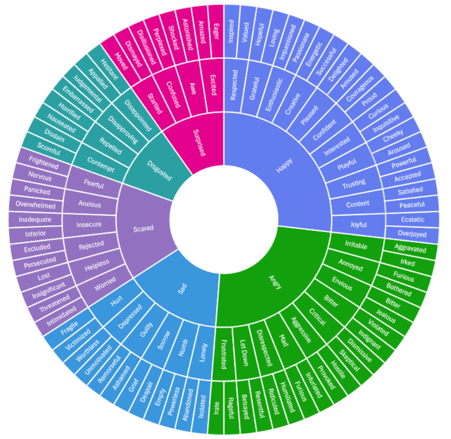

# Feelings Wheel

The goal of this website is to be a simple, easy-to-use app to help people identify their emotions by using a feelings wheel and an emotional check-in guide. As a former therapist, it was difficult to find a comprehensive feelings wheel for adults! So, we made our own!

## 🖥️ Deployed Link

[www.feelings-wheel.com](feelings-wheel.com)

## 🧭 Features
- A Feelings Wheel that spins and has a definition for each feeling
- Emotional Check-In Guide to help when you don't know what you're feeling

## 💻 Technologies Used

- React (Vite)
- CSS

## 🤝 Contributors
*Components of this were taken from a group project by:*
- [Sara Mattina](https://github.com/saramattina)
- [Dylan Tai](https://github.com/DylanTai)
